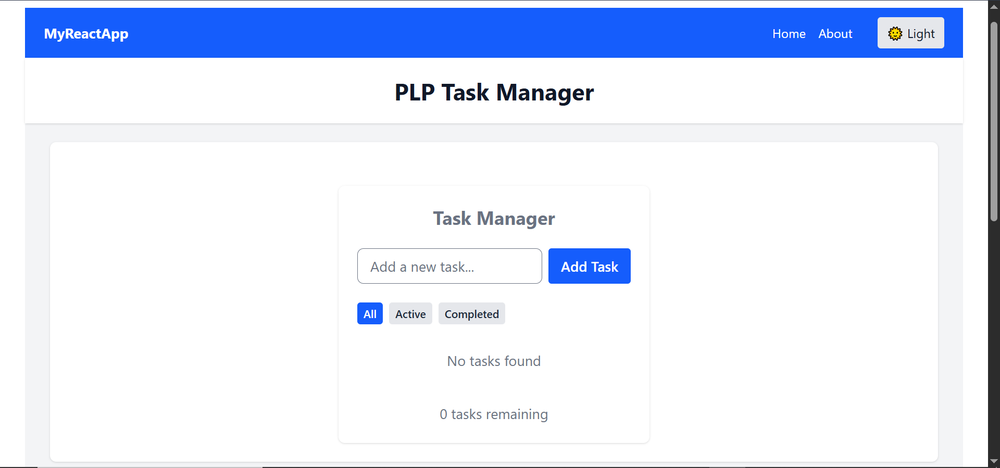
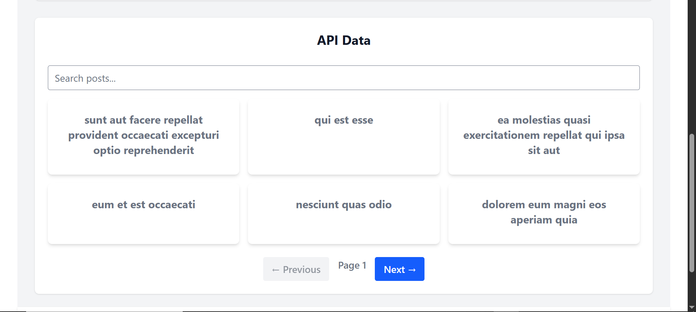
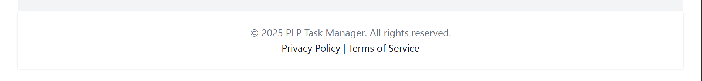
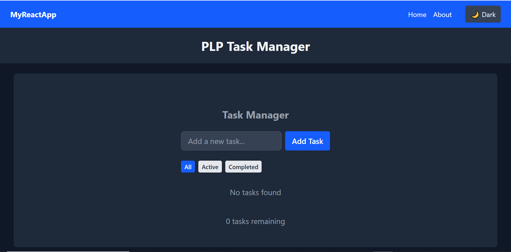
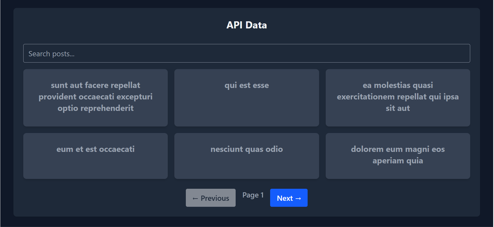

# PLP Task Manager - React & Tailwind CSS Assignment

## Project Overview
This is a responsive React application built using **JSX**, **Tailwind CSS**, and **React Router**.  
The application demonstrates component architecture, state management using React hooks, API integration, and responsive design principles.

---

## Features

- Responsive design for mobile, tablet, and desktop
- Light/Dark theme toggle
- Reusable UI components:
  - `Navbar`
  - `Footer`
  - `Card`
  - `Button`
- Task Manager functionality
- Fetch and display API data dynamically
- Custom animations and hover effects
- Modern layout with Tailwind CSS utilities

---
## Live Demo
Check out the app here: [Live Demo](https://your-demo-link.com)

## Setup Instructions
1. Clone the repository.
2. Install dependencies:
   ```
   npm install
   ```
3. Start the development server:
   ```
   npm run dev
   ```
Open your browser at http://localhost:5173 (default for Vite).  
## Requirements

- Node.js (v18 or higher)
- npm or yarn
- Modern web browser
- Code editor (VS Code recommended)

## Project Structure

```
src/
├── assets/           #Contains image files
├── components/       # Reusable UI components (Buttons,Card, Navbar...)
├── context/          # React context providers
├── hooks/            # Custom React hooks
├── pages/            # Page components
├── App.css         
├── App.jsx       
├── index.css            
├── main.jsx           
        
```
## Screenshots

### Light Mode




### Dark Mode




### API Data Display


## Notes
This project uses JSONPlaceholder for dummy API data:
`https://jsonplaceholder.typicode.com/posts?_page=${page}&_limit=${limit}`
The app fetches dummy posts from JSONPlaceholder and displays them as cards with title and body text.

## Resources

- [React Documentation](https://react.dev/)
- [Tailwind CSS Documentation](https://tailwindcss.com/docs)
- [Vite Documentation](https://vitejs.dev/guide/)
- [React Router Documentation](https://reactrouter.com/) 